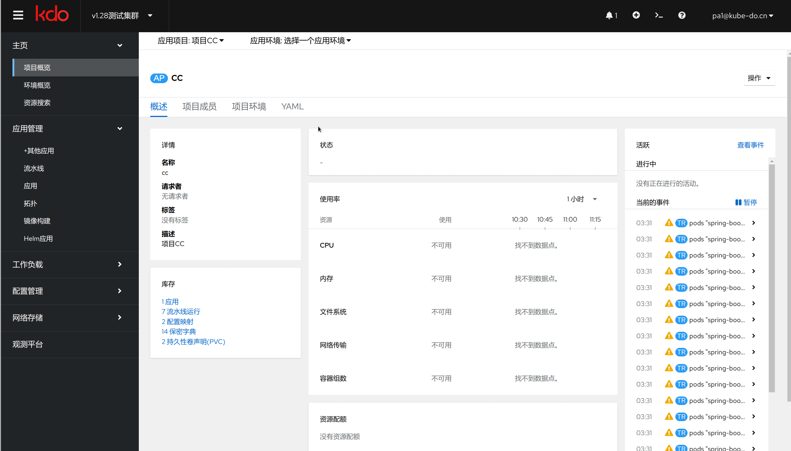

## 创建项目
项目只有集群管理员才能创建，菜单选择:管理->应用项目，点击新建

**名称**

项目的英文名字，

**显示名称**

项目在kdo平台显示名字

**描述**

关于这个项目的描述

**启用的环境**

默认启用的环境，主要有开发，测试，预发，生产四个环境

**项目负责人**

这个项目的负责人，负责人可以管理项目成员和项目环境

## 项目管理
项目作为应用开发的资源集合，可以管理整个项目，只有项目管理员才有权限管理项目

**项目概述**

项目整体概述

**项目成员**

项目成员的管理

**项目环境**

项目环境的管理

**YAML**

