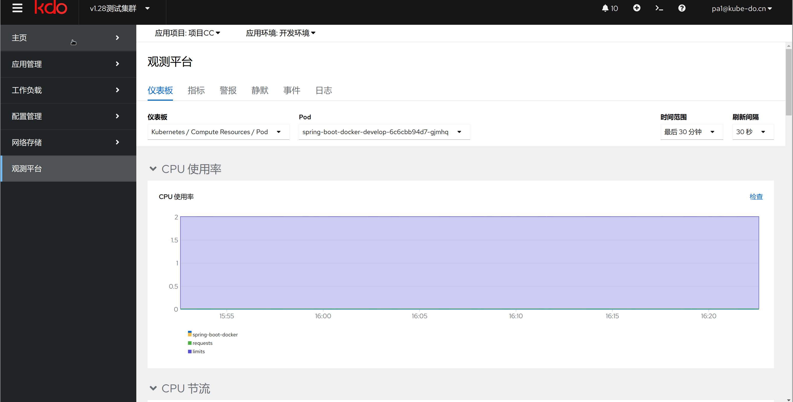

可观测性中心旨在提供全面的监控和可观测性支持，以确保系统的稳定性、性能和安全性。可观测性中心为企业提供了一个集中化的平台，使用户能够实时监控、分析和管理系统的运行状态和关键指标。它包括观测中心面板、监控大屏、全局日志、报警等功能，帮助用户快速发现和解决潜在的问题，提高系统的可靠性和可用性。

在本章节中，您将了解可观测性中心的各个组成部分的功能和优势，如何配置和使用这些功能，以及最佳实践和建议。

1. **[仪表盘](dashboards.md):**  对于新业务或已有业务，代码不需要改动就能将其容器化。不需要懂Docker 、Kubernetes等技术，就能将应用部署起来，具备云原生应用的全部特性。

2. **指标:**  通过应用级抽象，普通开发者了解应用的相关属性就能实现应用运维，并通过插件扩展监控、性能分析、日志、安全等运维能力，应用运维不再需要专用的SRE。

3. **警报:**  各类云原生应用以应用模版的形式存放到应用市场，当对接各种基础设施或云资源，实现应用即点即用或一键安装/升级。

4. **静默:**  复杂应用发布成应用模版，当客户环境可以联网，对接客户环境一键安装运行，当客户环境不能联网，导出离线应用模版，到客户环境导入并一键安装运行。

5. **事件:**  复杂应用发布成应用模版，当客户环境可以联网，对接客户环境一键安装运行，当客户环境不能联网，导出离线应用模版，到客户环境导入并一键安装运行。

6. **日志:**